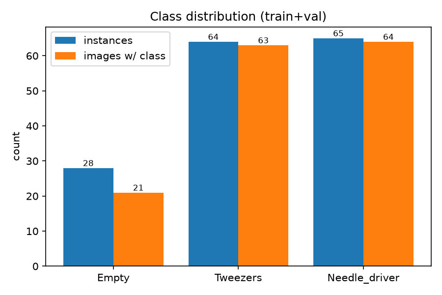
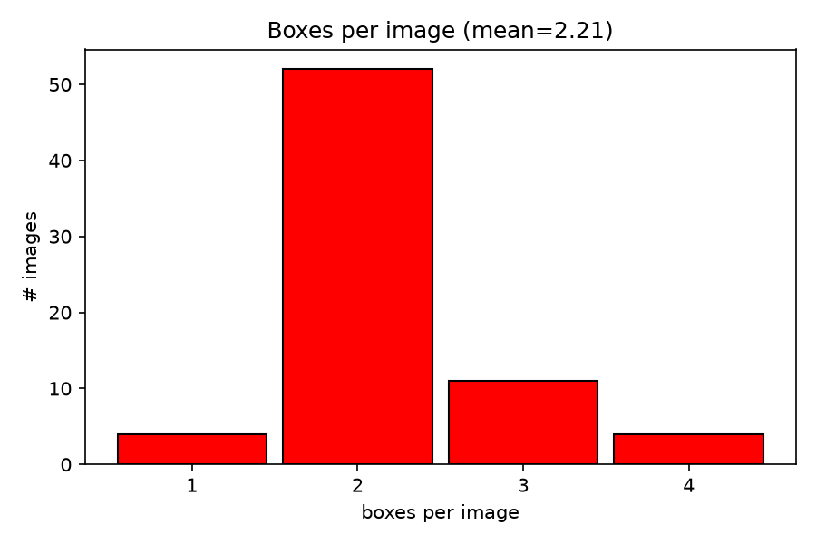
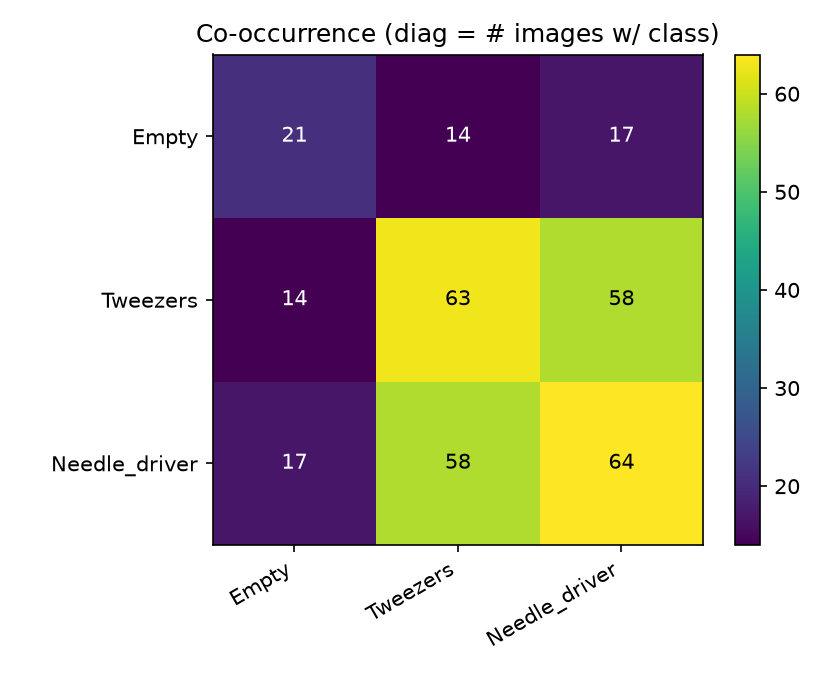
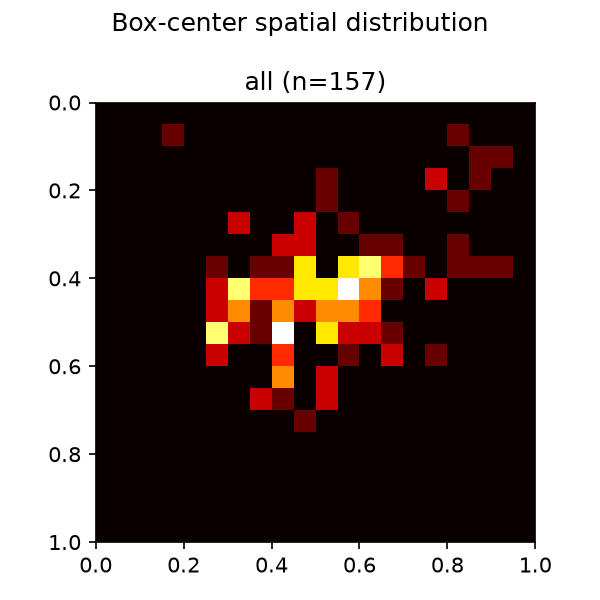
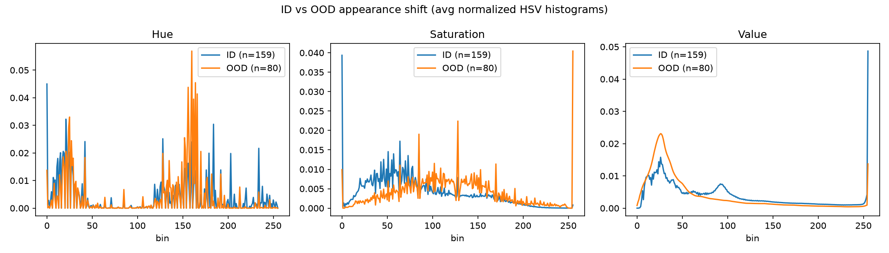

# Exploratory Data Analysis

`EDA.py` generates the figures and statistics used in the report's EDA section, from
the labeled image set and sampled video frames.

## Run

From the repo root:

```bash
cd ExploratoryDataAnalysis
python EDA.py
```

Figures are written to `ExploratoryDataAnalysis/eda_out/`, and summary numbers
(class counts, boxes-per-image stats, ID/OOD mean brightness & saturation) print to
the terminal.

## What it produces

| File | Description |
|------|-------------|
| `class_distribution.png` | Instances and #images per class (Empty / Tweezers / Needle_driver) |
| `boxes_per_image.png` | Distribution of the number of boxes per image |
| `cooccurrence.png` | Class co-occurrence matrix (which classes appear together) |
| `spatial_heatmap.png` | Heatmap of box-center locations over the normalized frame |
| `id_ood_shift.png` | ID vs OOD appearance shift — average HSV histograms |
| `rgb_intensity_shift.png` | ID vs OOD RGB channel + grayscale-intensity histograms |

Analyses 1–4 use the full labeled set (train + val, since val alone is tiny);
the ID/OOD comparisons sample frames from the ID and OOD videos.

## Data paths

Reads from `/datashare/HW1/`:
- labeled images/labels under `labeled_image_data/{images,labels}/{train,val}`
- ID videos under `id_video_data/`, OOD video under `ood_video_data/`

Paths, class names, and the number of frames sampled per video are set as constants
at the top of `EDA.py` — edit there if your layout differs.


## Example figures






