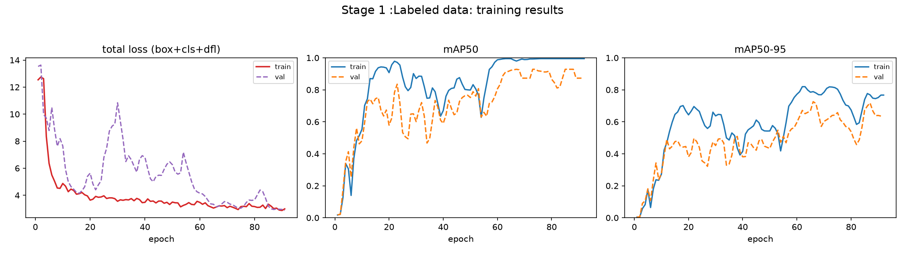
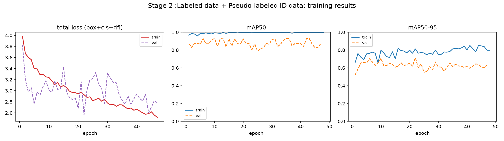
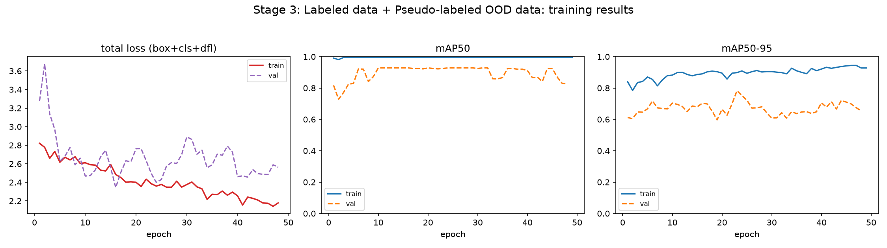
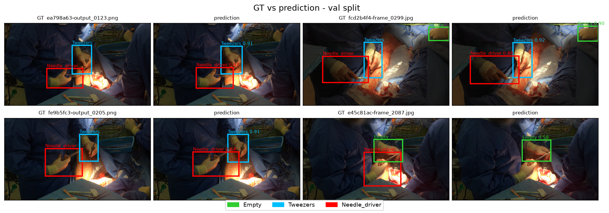

# Surgical Tool Detection — CV Surgical Applications, HW1

Semi-supervised object detection for surgical tools (hands + instruments) from a
small labeled image set (<100 images), generalized to an out-of-distribution (OOD)
surgery video via pseudo-labeling with YOLO.

**Classes:** `0 = Empty` (hand, no tool), `1 = Tweezers`, `2 = Needle_driver`.

## Model weights

For the final model weights (stage 3), please refer to this public Google Drive link containing the weights : **[[DOWNLOAD LINK HERE]](https://drive.google.com/file/d/1_idBa0yVFKYNtvzQvWP5OFsbGQlQUF_b/view?usp=sharing)**

However, do note that some scripts requires that the weights lie in a directory of the form "experiments/stage3/weights/best.pt".
For the reviewer's comfort, the weights have also been uploaded to this repository in the expected directory form.
<!-- replace with a link to experiments/stage3/weights/best.pt (Google Drive / release asset) -->

## Environment setup

```bash
# create/activate an environment (conda or venv), then:
pip install -r requirements.txt
```

Note: `requirements.txt` pins `torch` for CUDA 12.8 (`+cu128`). If your CUDA differs,
install a matching PyTorch build first (see https://pytorch.org), then the rest.

## Data

Expected on the server under `/datashare/HW1/`:

```
/datashare/HW1/
  labeled_image_data/images/{train,val}    # labeled frames (YOLO format)
  labeled_image_data/labels/{train,val}
  id_video_data/                           # 2 in-distribution videos
  ood_video_data/                          # 1 OOD video (surg_1.mp4)
```

Class names / paths are defined in `configs/data_stage{1,2,3}.yaml`.

## Deliverable scripts

**Run predictions on a single image** (YOLO-format output: `x_center y_center w h conf class`):
```bash
python scripts/predict.py --weights experiments/stage3/weights/best.pt \
    --source path/to/image.jpg --out preds.txt --save
```

**Run predictions on a video** (OpenCV overlay, class-labeled boxes):
```bash
python scripts/video.py --weights experiments/stage3/weights/best.pt \
    --source /datashare/HW1/ood_video_data/surg_1.mp4 \
    --out ood_stage3.mp4 --conf 0.25
```

## Reproducing the full SSL pipeline

The entire pipeline runs end to end with one script:

```bash
bash run_full_experiment.sh
```

It executes all four stages in order (train → pseudo-label ID → refine → pseudo-label
OOD → refine), calling the two primitives — **train** (`train_model.py`) and **generate
pseudo-labels** (`generate_psd_labels.py`) — with `build_dataset.py` combining labeled +
pseudo data between stages. Each stage's outputs (weights, `results.csv`, `train_map.csv`)
land in `experiments/<name>/`.

<details>
<summary>What the script runs (the individual stages)</summary>

```bash
# ── Step 1: train initial model on labeled data ────────────────────────────
python scripts/train_model.py --name stage1 --data configs/data_stage1.yaml \
  --weights yolo11s.pt --epochs 150 --lr0 1e-3 \
  --train-eval-data configs/data_stage1.yaml

# ── Step 2: generate ID pseudo-labels ──────────────────────────────────────
python scripts/generate_psd_labels.py \
  --weights experiments/stage1/weights/best.pt \
  --videos /datashare/HW1/id_video_data/4_2_24_B_2.mp4 \
           /datashare/HW1/id_video_data/20_2_24_1.mp4 \
          /datashare/HW1/ood_video_data/4_2_24_A_1.mp4 \
  --out pseudo_id --conf-track 0.35 --conf-keep 0.60 --min-track-len 8 --stride 10

# ── Step 3: refine with ID pseudo-labels (build combined set, then retrain) ─
python scripts/build_dataset.py --labeled-yaml configs/data_stage1.yaml \
  --pseudo-dir pseudo_id --labeled-repeat 5 --out-yaml data_stage2_combined.yaml
python scripts/train_model.py --name stage2 --data data_stage2_combined.yaml \
  --weights experiments/stage1/weights/best.pt --lr0 5e-4 \
  --train-eval-data configs/data_stage2.yaml

# ── Step 4: repeat 2–3 on the OOD video ────────────────────────────────────
python scripts/generate_psd_labels.py \
  --weights experiments/stage2/weights/best.pt \
  --videos /datashare/HW1/ood_video_data/surg_1.mp4 \
  --out pseudo_ood --conf-track 0.25 --conf-keep 0.45 --min-track-len 5 \
  --vid-stride 2 --imgsz 480 --half
python scripts/build_dataset.py --labeled-yaml configs/data_stage1.yaml \
  --pseudo-dir pseudo_ood --labeled-repeat 5 --out-yaml data_stage3_combined.yaml
python scripts/train_model.py --name stage3 --data data_stage3_combined.yaml \
  --weights experiments/stage2/weights/best.pt --lr0 5e-4 \
  --train-eval-data configs/data_stage3.yaml

```

</details>

## Pseudo-label heuristic

Detections are turned into pseudo-labels only if they belong to a **track** (ByteTrack)
that (a) persists at least `MIN_TRACK_LEN` frames and (b) has mean confidence ≥ `CONF_KEEP`.
Each track's boxes are relabeled to the track's majority class (removing per-frame class
flicker), and frames are subsampled by `STRIDE` to avoid near-duplicates.

## Analysis / plotting

```bash
python ExploratoryDataAnalysis/EDA.py            # class dist, boxes/image, co-occurrence, spatial, ID-vs-OOD shift
python scripts/plot_full_results.py              # per-stage train/val loss + mAP curves
python scripts/plot_gt_vs_pred.py                # GT vs final-model predictions (val split)
python scripts/plot_sample_grid.py               # labeled samples with GT boxes
```

## Repository layout

```
configs/                 data_stage{1,2,3}.yaml   (labeled dataset configs)
scripts/                 train_model.py, generate_psd_labels.py, build_dataset.py,
                         predict.py, video.py, custom_plots.py, plot_*.py
ExploratoryDataAnalysis/ EDA.py
requirements.txt
run_full_experiment.sh   (runs the pipeline end to end)
```

## Some figures




